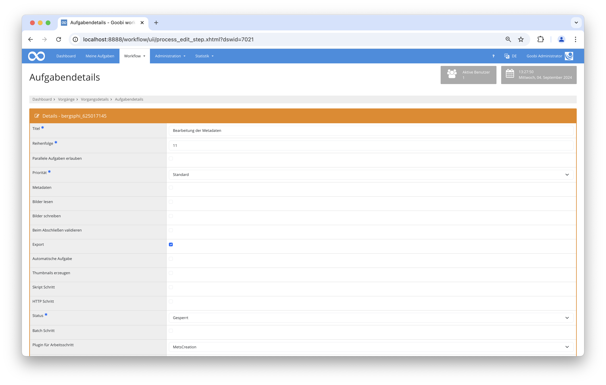

## Einführung
Diese Dokumentation erläutert wie mithilfe von mehreren Plugins METS Dateien geladen, bearbeitet und gespeichert werden. 

## Installation
Um das Plugin nutzen zu können, müssen folgende Dateien installiert werden:

```bash
/opt/digiverso/goobi/plugins/step/plugin-step-mets-creation-base.jar
/opt/digiverso/goobi/config/plugin_intranda_step_mets_creation.xml
```

Nach der Installation des Plugins kann dieses innerhalb des Workflows für die jeweiligen Arbeitsschritte ausgewählt und somit automatisch ausgeführt werden.

Für die Verwendung des Plugins muss dieses in einem Arbeitsschritt ausgewählt sein:




## Überblick und Funktionsweise
Bei der Auswahl des Plugins innerhalb des Arbeitsschrittes lässt sich eines von diesen Plugins auswählen: METSCreation, METSCreatePagination oder MapMETSCreation.

Wenn das METSCreation Plugin ausgeführt wird, dann wird die METS Datei geöffnet, gelesen, mit Standardwerten angereichert und gespeichert. 

Das METSCreatePagination Plugin öffnet ebenfalls die METS Datei und überprüft, ob es einen gültigen Pfad gibt. Sollte das nicht der Fall sein, wird einer erstellt. Anschließend werden die Bilddateien geladen und die logischen und physischen Nummerierungen verknüpft. Zuletzt werden die Metadaten gespeichert.

Im Fall, dass das MapMETSCreation Plugin ausgeführt wird, öffnet diese die METS Datei und ob das Metadatum `singleDigCollection` existiert. Sollte das nicht der Fall sein, wird diesem der Wert `Karten` zugewiesen. Danach wird überprüft ob es einen validen Dateipfad gibt und wenn es diesen nicht gibt, wird einer erstellt. Anschließend werden die existierenden Bilder geladen und die logischen und physischen Elemente miteinander verknüpft und gespeichert.

## Konfiguration
Die Konfiguration des Plugins erfolgt in der Datei `plugin_intranda_step_mets_creation.xml` wie hier aufgezeigt: 

{{CONFIG_CONTENT}}

{{CONFIG_DESCRIPTION_PROJECT_STEP}}