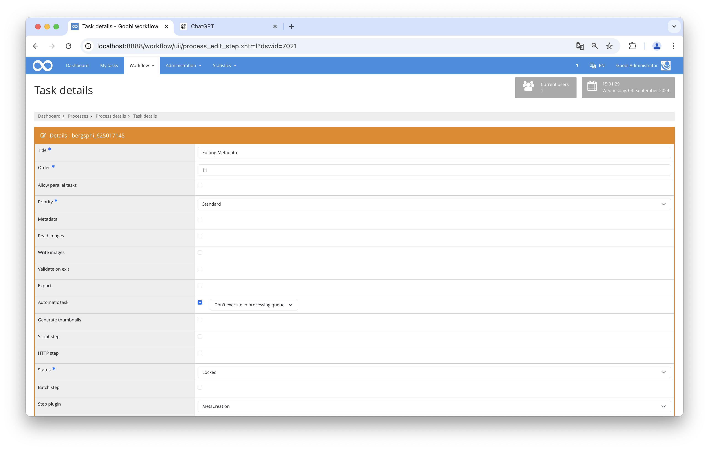

## Introduction
This documentation explains how multiple plugins can be used to load, edit, and save METS files.

## Installation
To be able to use the plugin, the following files must be installed:

```bash
/opt/digiverso/goobi/plugins/step/plugin-step-mets-creation-base.jar
/opt/digiverso/goobi/config/plugin_intranda_step_mets_creation.xml
```

Once the plugin has been installed, it can be selected within the workflow for the respective work steps and thus executed automatically.

To use the plugin, it must be selected in a workflow step:




## Overview and functionality
When selecting the plugin within the task, one of these plugins can be chosen: METSCreation, METSCreatePagination, or MapMETSCreation.

If the METSCreation plugin is executed, the METS file is opened, read, enriched with default values, and saved.

The METSCreatePagination plugin also opens the METS file and checks if there is a valid path. If not, one is created. The image files are then loaded, and the logical and physical numbering is linked. Finally, the metadata is saved.

If the MapMETSCreation plugin is executed, it opens the METS file and checks if the `singleDigCollection` metadata exists. If it does not, the value `Karten` (German for: `Maps`) is assigned. Then, it checks if there is a valid file path, and if there isn't, one is created. The existing images are loaded, and the logical and physical elements are linked and saved.

## Configuration
The plugin is configured in the file `plugin_intranda_step_mets_creation.xml` as shown here:

{{CONFIG_CONTENT}}

{{CONFIG_DESCRIPTION_PROJECT_STEP}}